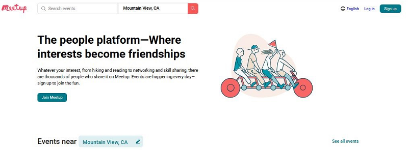

# Event Finder (Учебный проект)

Проект для отработки навыков верстки и базового JavaScript. Состоит из двух страниц с интерактивными элементами.

## 🛠 Технологии

- **HTML5** (семантическая верстка)
- **CSS3** (Flexbox, Grid, адаптивность)
- **JavaScript** (DOM-манипуляции, обработка событий)

## 🚀 Функционал

### Страница 1 (Главная)

- Кнопка `See all events` - переход на страницу фильтрации
- Остальные элементы статичны (учебный макет)

### Страница 2 (Фильтрация)

- **Меню фильтров**:
  - `Any type` → выпадающий список (online/offline)
  - `Any distance` → выбор радиуса (5km, 10km, 25km ...)
  - `Any category` → категории (Business, Technology и др.)
- Карточки мероприятий (статичные данные)

## 📁 Структура проекта

```
/Event_Finder
├── index1.html # Главная страница
├── index2.html # Страница фильтрации
├── css/
│ └── style.css # Стили
│ └── style2.css # Стили
├── js/
│ └── script.js # Логика фильтрации
└── images/ # Изображения
├── GitHub_Event_Finder.png
└── ...
```

## 🖼 Демонстрация



_Интерфейс приложения - главная страница_

---

[](https://vscode.dev/github/ваш-логин/Event_Finder)
